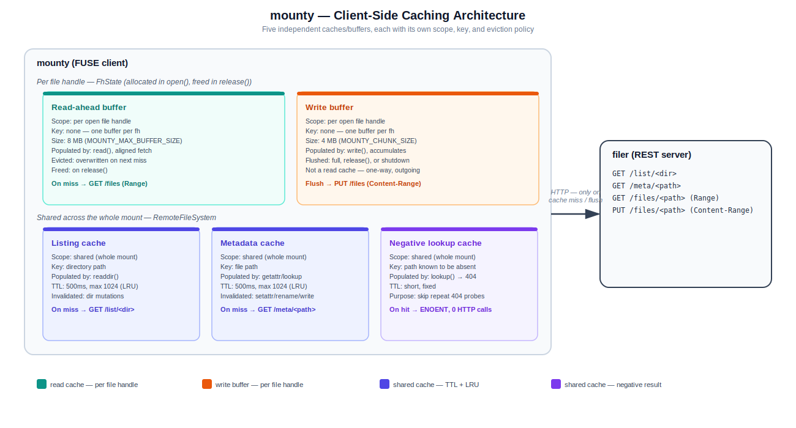

# mounty

A FUSE client, built with Rust, that mounts a remote directory served by
[`filer`](../filer/README.md) as a local filesystem. Files behave like local
files to any program (`cp`, `cat`, `mv`, ...); operations are translated to
HTTP calls.

## Features

- Mount a remote directory to a local path via FUSE
- Full read/write: create, read, write, truncate, delete, rename files and directories
- File attributes (size, permissions, timestamps) persisted
- Client-side caching: directory listing cache, metadata cache, negative-lookup cache
- Read-ahead and write buffering, tuned for large-file streaming (100MB+)
- Graceful shutdown on `SIGINT`/`SIGTERM`: flushes buffered writes and unmounts cleanly
- Linux support via `libfuse`/`fuser`; best-effort macOS support (macFUSE)

## Requirements

- `libfuse`/`fuse3` installed (Linux) or macFUSE (macOS)
- A running `filer` instance to connect to

## Usage

```bash
cargo run --release -- <server_url> <mountpoint>

# Example
cargo run --release -- http://localhost:3000 /mnt/remote

```

`mountpoint` must already exist. On startup, `mounty` probes the backend
(`GET /list/`) before mounting, so a broken/unreachable server fails fast
instead of mounting a filesystem that errors on every operation.

## Configuration

All optional, read from the environment at startup:

| Variable | Default | Purpose |
| --- | --- | --- |
| `MOUNTY_TTL_SECS` | `1` | Kernel attribute-cache TTL. |
| `MOUNTY_MAX_BUFFER_SIZE` | `8388608` (8MB) | Read-ahead buffer size. |
| `MOUNTY_CHUNK_SIZE` | `4194304` (4MB) | Write chunk size sent to `filer`. |
| `MOUNTY_LISTING_CACHE_TTL_MS` | `500` | Directory listing cache TTL. |
| `MOUNTY_LISTING_CACHE_CAPACITY` | `1024` | Directory listing cache size (LRU). |
| `MOUNTY_UID` / `MOUNTY_GID` | current user | UID/GID exposed on mounted files. |
| `MOUNTY_IOSIZE` | `1048576` | macOS-only FUSE I/O size hint. |

### Caching

`mounty` uses five independent caches/buffers — two per open file handle
(read-ahead, write buffer), three shared across the whole mount (listing,
metadata, negative lookup):



### Ownership

`mounty` exposes file ownership through FUSE attributes. By default it uses the
UID/GID of the running process. When running as a system daemon, run the service
as the user that should access the mount and set matching ownership via
`MOUNTY_UID`/`MOUNTY_GID`. For systemd this means `User=`/`Group=` plus those
variables; for launchd LaunchDaemons, `UserName`/`GroupName` plus those variables.

## Service Managers

For background operation, run `mounty` as a foreground process managed by the
platform service manager. The quickest path is the interactive installer:

```bash
./deploy/install.sh          # builds release binaries, installs + starts the service
./deploy/install.sh --dry-run   # preview without touching the system
```

It also asks which user/group should run `mounty` and keeps `MOUNTY_UID`/`MOUNTY_GID`
aligned with it. See `docs/service_manager_setup.md` for manual installation and
the systemd/launchd templates.

## Build

```bash
cargo build --release
```

## Testing

```bash
cargo test                   
```

`tests/e2e_mount_test.rs` builds `filer`, mounts a real FUSE filesystem, and
exercises it through the mountpoint (write/read, directories, rename,
permissions, truncate, copy).

## Layout

```text
src/
  main.rs               startup, mount, shutdown signal handling
  fs/
    fuse/mod.rs          fuser::Filesystem trait implementation
    remote_fs/           filesystem logic (dir_ops.rs, file_ops.rs)
    http/                HTTP client talking to filer
    utils/                inode mapping, file handles, path helpers
    config.rs             FuseConfig (env-driven tuning)
```
